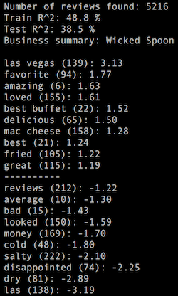

.. -*- mode: rst -*-

|Python36|

.. |Python36| image:: https://img.shields.io/badge/python-3.6-blue.svg
.. _Python36: https://badge.fury.io/py/scikit-learn

Food4Thought
============
Analyse restoration businesses strengths and weaknesses with the Yelp dataset.

Installation
------------
* clone this repository
* download the `Yelp dataset <https://www.yelp.com/dataset_challenge>`_ in the data folder
* install project dependencies: ``pip install -r requirements.txt``
* run the json to csv conversion script:   ``python convert.py ``
* go grab a coffee (conversion lasts ~10 minutes)

Usage example
-------------
Run the food4thought program with a brand/business name::

  python food4thought.py Wicked Spoon

You get the following output after two minutes:

Here we learn that the "mac cheese" of the Wicked Spoon is mentioned in positive reviews, while the word "cold" appears in negative ones.

Time to turn the heaters on and sell even more Mac Cheese!
